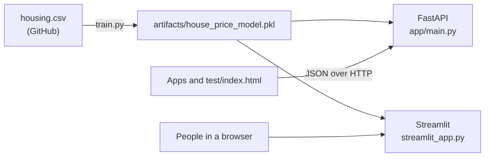

# House Price Prediction API

Predicts the median house value of a California neighborhood (a census block group) from the public California Housing dataset. Anyone can call it as a REST API, use it through a Streamlit web form, or try it with a plain HTML test page.

You send nine values that describe a block group: location, house age, rooms, bedrooms, population, households, median income and ocean proximity. You get back the predicted median house value in US dollars. A scikit-learn gradient boosting model makes the prediction. It is off by $29,362 on average on held-out data (R² 0.852).

## Three ways to use it

| Who | Use | Start it with |
|-----|-----|---------------|
| Developers (any language) | REST API: send JSON, get JSON | `uvicorn app.main:app --reload` |
| Anyone with a browser | Streamlit web form | `streamlit run streamlit_app.py` |
| Anyone testing the API by hand | `test/index.html` (HTML, CSS, JS) | open the file in a browser while the API runs |

The API and the Streamlit form load the same model file, so they return the same prices. The Streamlit form does not need the API to be running.

## Quick start

Prerequisites: Python 3.11 or newer and internet access for the first training run.

```bash
git clone https://github.com/TusharParlikar/House-Price-Prediction-API.git
cd House-Price-Prediction-API
python -m venv venv
venv\Scripts\activate          # Windows
# source venv/bin/activate     # macOS / Linux
pip install -r requirements-dev.txt
python train.py                # optional: the apps train on first use if needed
```

`python train.py` downloads the dataset to `data/`, trains, and saves the model to `artifacts/house_price_model.pkl`. It refuses to save a model whose test error is above $35,000.

Then start what you need:

```bash
uvicorn app.main:app --reload       # API at http://127.0.0.1:8000, docs at /docs
streamlit run streamlit_app.py      # web form at http://localhost:8501
```

To deploy both online, see [deploy.md](deploy.md).

## Use the API

| Method | Path | Body | Response |
|--------|------|------|----------|
| `GET` | `/` | none | `{"message": "Welcome to the House Price Prediction API"}` |
| `POST` | `/predict` | one house object | `{"predicted_price": 448755.71}` |
| `POST` | `/predict_batch` | `{"houses": [house, ...]}` (at least 1) | `{"predicted_prices": [448755.71, ...]}` |

FastAPI also serves interactive docs at `/docs`, with a sample request you can run from the browser. CORS allows every origin, so web apps on any site can call the API.

### Example request

```bash
curl -X POST http://127.0.0.1:8000/predict \
  -H "Content-Type: application/json" \
  -d '{"longitude": -122.23, "latitude": 37.88, "housing_median_age": 41,
       "total_rooms": 880, "total_bedrooms": 129, "population": 322,
       "households": 126, "median_income": 8.3252, "ocean_proximity": "NEAR BAY"}'
```

This is the first row of the dataset. Its real median value is $452,600.

```js
// JavaScript (browser or Node 18+)
const res = await fetch("http://127.0.0.1:8000/predict", {
  method: "POST",
  headers: { "Content-Type": "application/json" },
  body: JSON.stringify(house),
});
const { predicted_price } = await res.json();
```

```python
# Python
import requests
r = requests.post("http://127.0.0.1:8000/predict_batch", json={"houses": [house, house]})
print(r.json()["predicted_prices"])
```

### Input fields

All nine fields are required.

| Field | Meaning | Allowed values |
|-------|---------|----------------|
| `longitude` | Block group longitude | -124.5 to -114.0 (California) |
| `latitude` | Block group latitude | 32.5 to 42.0 (California) |
| `housing_median_age` | Median age of the houses, in years | ≥ 0 |
| `total_rooms` | Total rooms in the block group | > 0 |
| `total_bedrooms` | Total bedrooms in the block group | ≥ 0 and not more than `total_rooms` |
| `population` | People living in the block group | ≥ 0 |
| `households` | Households in the block group | > 0 |
| `median_income` | Median household income in tens of thousands of USD (`8.3` = $83,000) | ≥ 0 |
| `ocean_proximity` | Distance to the ocean | `<1H OCEAN`, `INLAND`, `ISLAND`, `NEAR BAY`, `NEAR OCEAN` |

Numbers must be finite: `NaN` and `Infinity` are rejected.

### Errors

Invalid input returns `422` with one entry per problem:

```json
{"detail": [{"type": "greater_than", "loc": ["body", "households"],
             "msg": "Input should be greater than 0"}]}
```

## Use the web form

Run `streamlit run streamlit_app.py` and open http://localhost:8501. The form starts with the first row of the dataset. Change the values and click **Predict price**. Invalid values show the same error messages as the API.

## Use the test page

Start the API, then open `test/index.html` in a browser. It sends the form to `POST /predict` and shows the price or the errors. Change **API URL** to test a deployed API.

## How it works



- **Data**: the California Housing dataset (1990 US census, 20,640 block groups), read from the [handson-ml2 repository](https://github.com/ageron/handson-ml2/tree/master/datasets/housing). The 207 rows with no `total_bedrooms` are dropped, which leaves 20,433.
- **Model**: one scikit-learn pipeline. It adds rooms per household, bedrooms per room and people per household, one-hot encodes `ocean_proximity`, then runs `HistGradientBoostingRegressor`. Split 80/20 with `random_state=42`.
- **Accuracy on the test set**: R² 0.852, mean absolute error $29,362. Training also prints a 5-fold cross-validation error.
- **Loading**: `get_model()` in `app/models/price_model.py` loads the saved model once per process, or trains one if the file is missing.

`notebooks/model_training.ipynb` walks through the training steps and compares the model with the old linear baseline.

## Project structure

```text
app/main.py                          FastAPI app: CORS, error format, routes
app/controllers/prediction_controller.py  Endpoints: /, /predict, /predict_batch
app/models/schemas.py                Request and response shapes, input validation
app/models/price_model.py            Data download, training, saving, loading, prediction
streamlit_app.py                     Streamlit web form
train.py                             python train.py: trains and saves the model
test/                                Plain HTML/CSS/JS page for testing the API
tests/                               pytest tests for the API, model and web form
notebooks/model_training.ipynb       Training walkthrough
deploy.md                            How to deploy the API and the web form
requirements.txt                     Runtime dependencies (what a server installs)
requirements-dev.txt                 Adds pytest and Jupyter
```

## Tests

```bash
python -m pytest
```

The tests cover every endpoint, check that single and batch predictions agree, check CORS, check the `422` errors for bad input, check the model's accuracy, and check that the web form shows the same price as the model.

## Limitations

- **Old, capped data**: values are from 1990, in 1990 dollars. The dataset caps values at $500,001, so the model never predicts much above that.
- **Neighborhood level only**: a prediction is a block-group median, not an appraisal of one house.
- **Open to everyone**: no authentication or rate limiting. Anyone with the URL can call the API.
- **Pickle file**: `pickle.load` can run code from the file it loads. Only load a model you trained yourself.
