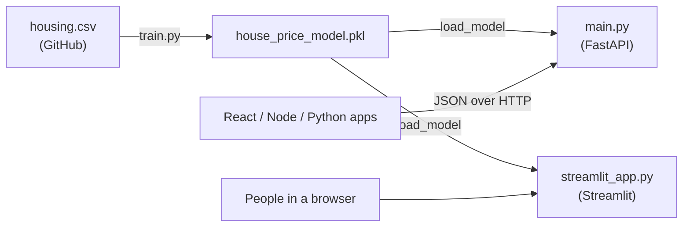

# House Price Prediction API

Predicts median house values for California neighborhoods, built on the public California Housing dataset. Developers call it as a REST API. Everyone else can use a Streamlit web form.

You give six numbers that describe a census block group (house age, rooms, bedrooms, population, households, median income). You get back the predicted median house value in US dollars. A scikit-learn Linear Regression model does the prediction. The training script downloads the data and builds the model, so the repository contains no data or model files.

## Two ways to use it

| Who | Use | Start it with |
|-----|-----|---------------|
| Developers (React, Node, Python, any language) | REST API: send JSON, get JSON | `uvicorn main:app --reload` |
| Anyone with a browser | Streamlit web form | `streamlit run streamlit_app.py` |

Both load the same model file, so they return the same prices. The web form doesn't need the API to be running.

## Features

- **Single prediction**: `POST /predict` returns a price for one block group.
- **Batch prediction**: `POST /predict_batch` returns prices for many block groups in one call.
- **Callable from browsers**: CORS is open, so a React or other front-end app on any site can call the API.
- **Input validation**: negative, missing, NaN or Infinity values get a `422` error that names the bad field.
- **Interactive docs**: Swagger UI at `/docs` with a ready-to-run sample request and typed responses.
- **Web form**: `streamlit_app.py` shows the prediction for values typed into a form.
- **Automatic training**: if the model file is missing, the API or the web form trains one on first start.

## Quick start

Prerequisites: Python 3.11 or newer (tested on 3.14) and internet access for the first training run.

```bash
git clone https://github.com/TusharParlikar/House-Price-Prediction-API.git
cd House-Price-Prediction-API
python -m venv venv
venv\Scripts\activate          # Windows
# source venv/bin/activate     # macOS / Linux
pip install -r requirements.txt
python train.py                # optional: the apps train on first start if needed
```

`python train.py` prints:

```text
R^2 score:  0.571
MAE:        $56,642
Model saved to .../house_price_model.pkl
```

Then start the API, the web form, or both:

```bash
uvicorn main:app --reload              # API at http://127.0.0.1:8000, docs at /docs
streamlit run streamlit_app.py         # web form at http://localhost:8501
```

## Use the API

| Method | Path | Body | Response |
|--------|------|------|----------|
| `GET` | `/` | none | `{"message": "Welcome to the House Price Prediction API"}` |
| `POST` | `/predict` | one house object | `{"predicted_price": 428125.14}` |
| `POST` | `/predict_batch` | `{"houses": [house, ...]}` (at least 1) | `{"predicted_prices": [428125.14, ...]}` |

FastAPI also serves `/docs` (Swagger UI), `/redoc` and `/openapi.json`. Replace `http://127.0.0.1:8000` in the examples with your deployed URL once the API is online.

### JavaScript (React, Node 18+)

```js
const res = await fetch("http://127.0.0.1:8000/predict", {
  method: "POST",
  headers: { "Content-Type": "application/json" },
  body: JSON.stringify({
    housing_median_age: 41,
    total_rooms: 880,
    total_bedrooms: 129,
    population: 322,
    households: 126,
    median_income: 8.3252,
  }),
});
const { predicted_price } = await res.json(); // 428125.14360750734
```

This is the first row of the dataset. Its real median value is $452,600.

### Python

```python
import requests

house = {"housing_median_age": 41, "total_rooms": 880, "total_bedrooms": 129,
         "population": 322, "households": 126, "median_income": 8.3252}
r = requests.post("http://127.0.0.1:8000/predict_batch", json={"houses": [house, house]})
print(r.json())  # {'predicted_prices': [428125.14..., 428125.14...]}
```

### curl

```bash
curl -X POST http://127.0.0.1:8000/predict \
  -H "Content-Type: application/json" \
  -d '{"housing_median_age": 41, "total_rooms": 880, "total_bedrooms": 129,
       "population": 322, "households": 126, "median_income": 8.3252}'
```

### Input fields

All six fields are required, and each must be a finite number ≥ 0. Each request describes one census **block group** (a small neighborhood), not one house.

| Field | Meaning | Range in the training data |
|-------|---------|----------------------------|
| `housing_median_age` | Median age of the houses, in years | 1 to 52 |
| `total_rooms` | Total rooms in the whole block group | 2 to 39,320 |
| `total_bedrooms` | Total bedrooms in the whole block group | 1 to 6,445 |
| `population` | People living in the block group | 3 to 35,682 |
| `households` | Households in the block group | 1 to 6,082 |
| `median_income` | Median household income in tens of thousands of USD (`8.3` = $83,000) | 0.5 to 15.0 |

### Errors

Invalid input returns `422` with one entry per problem:

```json
{"detail": [{"type": "greater_than_equal", "loc": ["body", "population"],
             "msg": "Input should be greater than or equal to 0", "ctx": {"ge": 0.0}}]}
```

## Use the web form

Run `streamlit run streamlit_app.py` and open http://localhost:8501. The form starts with the first row of the dataset. Change the values and click **Predict price**.

## Put it online

The API and the web form deploy separately. Each one trains its model on the server, because the model file isn't in Git.

**API** on any Python host, for example a Render Web Service connected to this repository:

| Setting | Value |
|---------|-------|
| Build command | `pip install -r requirements.txt && python train.py` |
| Start command | `uvicorn main:app --host 0.0.0.0 --port $PORT` |

Share `https://<your-api-host>/docs` with developers. Python 3.11 or newer is required. On Render, set the `PYTHON_VERSION` environment variable if the default is older.

**Web form** on Streamlit Community Cloud: sign in at https://share.streamlit.io with GitHub, create an app from this repository, branch `main`, main file `streamlit_app.py`.

To run the API on your own server with several worker processes, train first so the workers don't all train at once:

```bash
python train.py
uvicorn main:app --host 0.0.0.0 --port 8000 --workers 4
```

## How it works



*Where the model comes from and how each kind of user reaches it.*

- **Data**: the California Housing dataset (Pace & Barry, 1997), 1990 US census, 20,640 block groups. `train.py` reads it from the [handson-ml2 repository](https://github.com/ageron/handson-ml2/tree/master/datasets/housing).
- **Cleaning**: the 207 rows with no `total_bedrooms` are dropped, which leaves 20,433 rows.
- **Model**: `LinearRegression` on the six input fields, with an 80/20 train/test split (`random_state=42`).
- **Accuracy on the test set**: R² 0.571, mean absolute error $56,642.
- **Loading**: `load_model()` in `train.py` loads `house_price_model.pkl`, or trains a new model if the file doesn't exist. The API calls it once at startup. The web form caches it with `st.cache_resource`.

`House_rate_prediction_API.ipynb` runs the same training steps one at a time, with output after each step.

## Project structure

```text
main.py                          FastAPI app: schemas, validation, CORS, endpoints
streamlit_app.py                 Streamlit web form
train.py                         Downloads data, trains, evaluates, saves and loads the model
House_rate_prediction_API.ipynb  The same training steps as a notebook
test_main.py                     API tests (pytest + FastAPI TestClient)
test_streamlit_app.py            Web form test (Streamlit AppTest)
requirements.txt                 Pinned dependencies
house_price_model.pkl            Trained model, created on first run (gitignored)
```

## Tests

```bash
python -m pytest
```

The tests cover every endpoint, check that single and batch predictions agree, and check the CORS preflight. They also check the `422` errors for negative, NaN, Infinity and empty-batch input, and check that the web form shows the expected price. If no model file exists yet, the first run trains one, which needs internet access.

## Limitations

- **Baseline accuracy**: predictions are off by $56,642 on average (R² 0.571). Adding features (location, rooms per household) or using a tree-based model would improve this.
- **Location is ignored**: the dataset has `longitude`, `latitude` and `ocean_proximity`, but the model doesn't use them. Location affects price a lot.
- **Old, capped data**: values are from the 1990 census, in 1990 dollars. The dataset caps house values at $500,001, so the model has no examples above that.
- **Linear model**: inputs far outside the training ranges give unrealistic results. For example, all zeros predicts −$45,966.
- **Neighborhood level only**: a prediction is a block-group median, not an appraisal of one house.
- **Open to everyone**: there is no authentication or rate limiting, and CORS allows every origin. Anyone who has the URL can call the API.
- **Pickle file**: `pickle.load` can run code from the file it loads. Only load a model you trained yourself.

## License

No license file yet.
